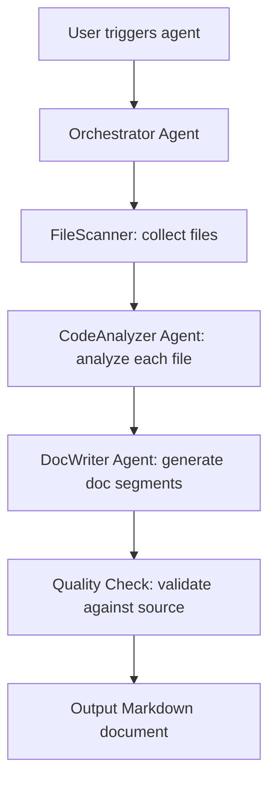

# Code Documentation AI Agent Demo

An intelligent multi-agent system that automatically scans code repositories and generates/updates technical documentation using **MiMo-V2.5-Pro** (or any OpenAI-compatible LLM).

## 🎯 Core Problem Solved

Manual documentation is tedious, easily outdated, and becomes a bottleneck in agile teams. This agent automates the entire documentation lifecycle:
- Scans source code files
- Analyzes functions, classes, and APIs
- Generates structured Markdown docs
- Proposes documentation updates via PR (CI integration ready)

## 🧠 Core Logic Flow (Long‑Chain Reasoning + Multi‑Agent Collaboration)

